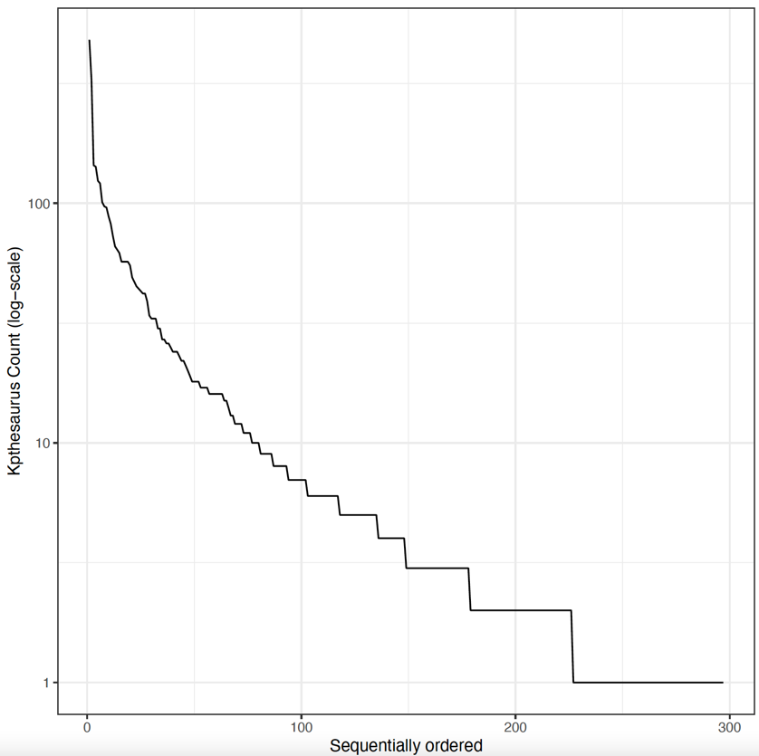

## Project Submission for PhD Course

### Tools for Scientific Software Development and Data Science, AAU

### PhD Student: Kashif Rabbani

The project contains solutions to the following two tasks:

- **Part A:** A programming/tool part on bash and version control with Git using the pre-defined project as described in
  the project.
- **Part B:** A software management plan for my PhD.

#### Part A:

I have written a script in `script.sh` file located in the main project directory. 


**1) How to run the script?**

Execute the script file : `./script.sh`. Note: You may have to change the permission on the script file.

**2) What is the purpose and how is this accomplished?**

The purpose the script is to read the data files of European Court of Human Rights from the data directory and extract
IDs of various cases from each file in an iterative manner (using the provided Python script) and stores all the IDs
mentioned in each data file in a file called `distribution_data.dat` along with each document ID, e.g., 001-100865.json.

Further, in order to visualize the distribution of 'how often different IDs are mentioned in each document', the script
uses the provided R script and executes it by providing `distribution_data.dat` file.
This will result in a chart shown below.


Script:
```
base='data' # Specify directory containing data files
data_files=($(ls $base)) # Save all the file names as array

# Iterate over each file

for file in $data_files
do
  file_path="${base}/$file"
  output=$(python3 print_kpthesaurus.py "$file_path") # Run python script with file address and store output
  file_prefix="${file%%.*}" # trim .json from the file name

  # skip empty output and store the result in a .dat file
  if [ ! -z "$output" ]
  then print "${file_prefix};$output" >> distribution_data.dat
  fi
done

# Run R script with newly created distribution_data.dat file
Rscript analyse_and_visualize.r distribution_data.dat
```
Chart:




---

#### Part B:

I have created a software management plan for my PhD. You can find it [here](https://github.com/Kashif-Rabbani/sci-sw-dev-2021/blob/kashif-rabbani/scientific_software_management_plan.md). 
