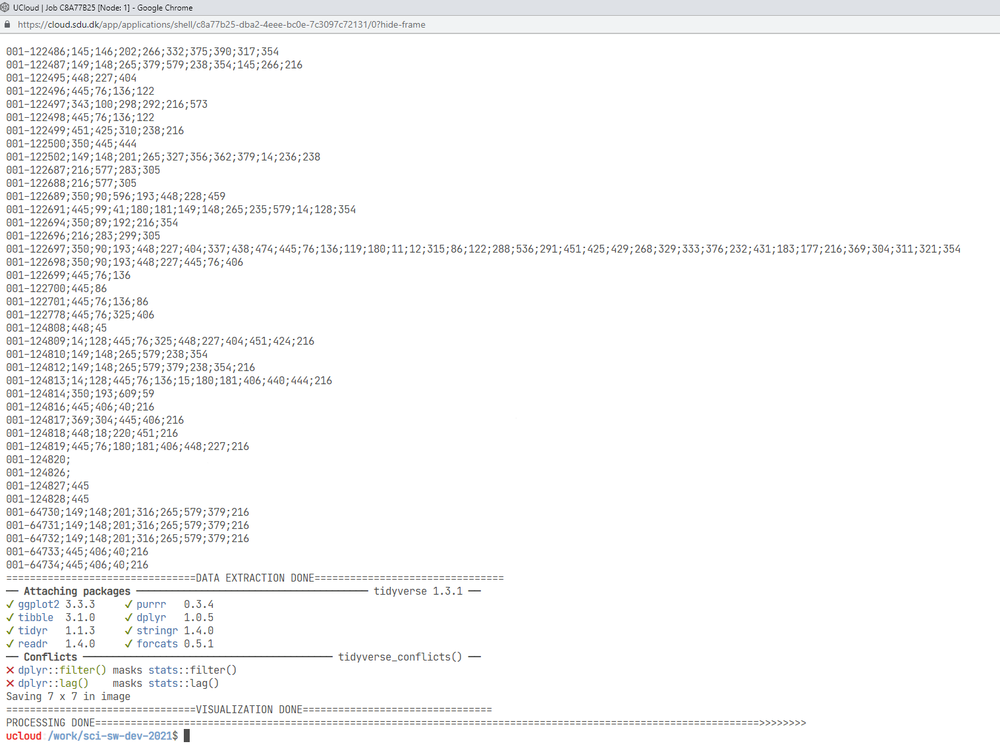
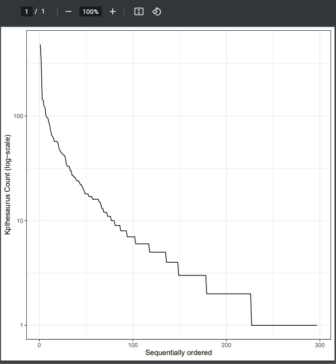

# sci-sw-dev-2021
Repository for projects in the PhD course Tools for Scientific Software Development and Data Science<br/>
# Analysing data from European Court of Human Rights
#### Code and documentation submitted by Avishek Das (adas@create.aau.dk)

### Available Resources
* A given python file (print_kpthesaurus.py) to extract IDs of each case.
* A given R file (analyse_and_visualize.r) to produce plot of the ID against cases.
* A set of case files in JSON format

### Requirement
* Need to develop to a **Bash** script to automate the process of gathering data from the files, extracting ID and plot the data using Python and R scripts. In a way the **Bash** script will perform as a glue between two piece of tools and data.

## The Code

 ```shell
 #!/bin/bash
 DATFILE=filename.dat
 TXTFILE=numbers.txt
 if test -f "$DATFILE"; then
         $(rm filename.dat)
 fi

 if test -f "$TXTFILE"; then
         $(rm numbers.txt)
 fi

 for  file in "$@"
 do
         # Prepare the filename format. Extract the name without the path and extension
         filename=${file:5:-5}
         # Extract the data from the file by running the python file
         extractedData=$(python3 print_kpthesaurus.py $file)
         # Create a separator. In this case a Semicolon
         separator=";"
         # Create an output string to be shown and stored
         outputString="${filename}${separator}${extractedData}"
         # Show the output string in the terminal just to make sure
         echo $outputString
         # Save the string in a textfile. >> is used to append each line to its last line ( this is for user to see a simple text file)
         echo $outputString >> numbers.txt
         # Save the lines in a DAT file to be processed with R
         echo $outputString >> RDATAFILE.dat
 done
 echo "================================DATA EXTRACTION DONE================================"
 # Run R Script
 runRscript=$(Rscript analyse_and_visualize.r RDATAFILE.dat)
 echo "================================VISUALIZATION DONE================================"
 echo "PROCESSING DONE================================================================================================================>>>>>>>>"
```
### Usage
The data folder contains 1000 JSON files. In order to process multiple files of that magnitude to complete statistical analysis, it is easier to automate. So while one file extracts data and other does the statistical analysis on those data. That is the reason, we are using the Bash script to process data so that we can scale the data analysis.
### Methodology
The script takes one argument. As an argument it can take one or multiple files. In this case it takes multiple files as input. It outputs two files, one for human readable TXT file and another, DAT file to be processed by the R in the next part of the script.
At first it checks if a file a name exists, if yes, it deletes that file before creating the file again.<br/>
At first a set of JSON files are processes by the python script. It extracts the ID. In the next part the bash script extracts the corresponding file names and joins the already semicolon separated IDs with semicolon. To make the it comprehensible to human, each data that is to be written into the text and DAT file, is echoed in the screen to keep the users engaged and to make sure nothing out of order is happening.<br/>
Finally, the program saves a DAT file and the same file is passed to the R script which generates the plot.
Once the script is compiled, it should look like this:<br/>
<br/>

And the plot looks like this:<br/>
<br/>

### Interaction Process
First run the following command to make sure the code has right permissions.
```shell
chmod u+x script-avishek.sh

```
Now, supply the argument for the script, the files. In this case, all of the JSON files.
```shell
./script-avishek.sh data/*.json

```
This should start the process and generate the plot. It is possible to supply one file, or multiple through the argument.
